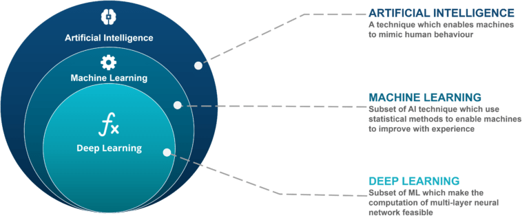

### ¿Qué relación existe entre el concepto de *Machine Learning* y la *Inteligencia Artificial*?



La **Inteligencia Artificial (IA)** es un campo amplio de la informática cuyo objetivo es desarrollar sistemas capaces de realizar tareas que normalmente requieren inteligencia humana: razonar, planificar, entender el lenguaje, reconocer patrones, tomar decisiones, entre otras.

Dentro de este gran campo, encontramos al **Machine Learning (ML)**, que es una **subdisciplina de la IA**. Es decir:

> **El Machine Learning es una forma de implementar IA.**

Mientras que la IA puede incluir enfoques programados manualmente (como reglas lógicas, sistemas expertos, búsqueda heurística), el Machine Learning permite a las máquinas **aprender automáticamente a partir de datos** sin ser explícitamente programadas para cada tarea.

#### Relación jerárquica

Podés imaginarlo así:

```
Inteligencia Artificial
│
├── Machine Learning
│   └── Deep Learning (una subcategoría específica con redes neuronales profundas)
```

#### Diferencias clave

| Inteligencia Artificial (IA)                     | Machine Learning (ML)                                                               |
| ------------------------------------------------ | ----------------------------------------------------------------------------------- |
| Campo general                                    | Subcampo específico                                                                 |
| Incluye lógica, planificación, percepción, etc.  | Se centra en aprendizaje desde datos                                                |
| Puede estar basada en reglas                     | Basado en algoritmos que ajustan modelos con datos                                  |
| Ejemplo: sistema experto para diagnóstico médico | Ejemplo: modelo que aprende a detectar enfermedades analizando historiales clínicos |

#### Conclusión

En resumen, **todo algoritmo de Machine Learning es una forma de Inteligencia Artificial**, pero **no toda IA implica necesariamente Machine Learning**. Hoy en día, sin embargo, muchas de las aplicaciones más potentes de IA modernas (como el reconocimiento de voz, visión por computadora, traducción automática) se basan justamente en técnicas de Machine Learning, y especialmente en Deep Learning.

* [Machine Learning](https://www.clicdata.com/blog/ai-ml-data-science-deep-learning/)
* [IA Machine Learning](https://www.edureka.co/blog/ai-vs-machine-learning-vs-deep-learning/)