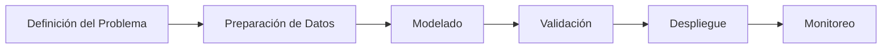

## **Pasos para Implementar un Modelo de Machine Learning**  
### **1. Definición del Problema**  
- **Objetivo claro**: ¿Qué queremos predecir o clasificar? (ej.: predecir ventas, detectar fraudes).  
- **Métricas de éxito**: ¿Cómo mediremos el rendimiento? (ej.: precisión, RMSE, AUC-ROC).  

---

### **2. Preparación de Datos**  
#### **Limpieza de Datos**  
- **Valores faltantes**:  
  ```python
  df.fillna(df.mean(), inplace=True)  # Imputar con media
  ```  
- **Outliers**:  
  ```python
  from scipy import stats
  df = df[(np.abs(stats.zscore(df['columna'])) < 3)]  # Eliminar outliers con z-score
  ```  
- **Datos duplicados**:  
  ```python
  df.drop_duplicates(inplace=True)
  ```  

#### **Transformación de Datos**  
- **Codificación de variables categóricas**:  
  ```python
  from sklearn.preprocessing import OneHotEncoder
  encoder = OneHotEncoder()
  encoded_data = encoder.fit_transform(df[['categoría']])
  ```  
- **Normalización/Estandarización**:  
  ```python
  from sklearn.preprocessing import StandardScaler
  scaler = StandardScaler()
  df[['columna']] = scaler.fit_transform(df[['columna']])
  ```  

### **Normalización vs. Estandarización: ¿Cuándo usarlas?**  

Ambas técnicas transforman los datos para que estén en una **escala adecuada** para los algoritmos de Machine Learning, pero se aplican en diferentes escenarios:  

| **Característica**       | **Normalización (Min-Max Scaling)** | **Estandarización (Z-Score Scaling)** |  
|--------------------------|-------------------------------------|---------------------------------------|  
| **Fórmula**              | \( \frac{X - X_{\text{min}}}{X_{\text{max}} - X_{\text{min}}} \) | \( \frac{X - \mu}{\sigma} \) (media \(\mu\), desviación \(\sigma\)) |  
| **Rango resultante**     | [0, 1] o [-1, 1]                   | No tiene rango fijo (media = 0, desviación = 1). |  
| **Uso recomendado**      | - Algoritmos sensibles a rangos (ej.: redes neuronales, K-NN). <br> - Datos con distribución no gaussiana. | - Algoritmos que asumen distribución gaussiana (ej.: SVM, regresión lineal). <br> - Datos con outliers (es más robusta). |  

#### **¿Cuál elegir?**  
- Usa **normalización** si:  
  - Tus datos tienen límites conocidos (ej.: imágenes RGB [0, 255]).  
  - Trabajas con algoritmos que requieren datos en un rango específico (ej.: redes neuronales).  
- Usa **estandarización** si:  
  - Hay outliers (la normalización se ve afectada por valores extremos).  
  - El algoritmo asume que los datos están centrados en 0 (ej.: PCA, SVM).  

---

#### **Selección de Características**  
- **Métodos estadísticos**:  
  ```python
  from sklearn.feature_selection import SelectKBest, f_regression
  selector = SelectKBest(score_func=f_regression, k=5)
  X_new = selector.fit_transform(X, y)
  ```  
- **Importancia con Random Forest**:  
  ```python
  from sklearn.ensemble import RandomForestClassifier
  model = RandomForestClassifier()
  model.fit(X, y)
  importancias = model.feature_importances_
  ```  

---

### **3. Modelado**  
#### **División de Datos**  
```python
from sklearn.model_selection import train_test_split
X_train, X_test, y_train, y_test = train_test_split(X, y, test_size=0.2, random_state=42)
```  


### **Train, Test y Validation: ¿Cuándo y cómo usarlos?**  
La división de datos en **train**, **validation** y **test** es clave para evaluar la generalización del modelo.  

#### **1. División Básica (Train/Test)**  
- **Train (70-80%)**: Para entrenar el modelo.  
- **Test (20-30%)**: Para evaluar el rendimiento final.  
```python
from sklearn.model_selection import train_test_split
X_train, X_test, y_train, y_test = train_test_split(X, y, test_size=0.2, random_state=42)
```  

#### **2. División con Validation Set**  
- **Train (60%)**: Entrenamiento.  
- **Validation (20%)**: Ajustar hiperparámetros (ej.: elegir entre Random Forest con `max_depth=5` o `10`).  
- **Test (20%)**: Evaluación final (solo se usa una vez al final).  
```python
X_train, X_temp, y_train, y_temp = train_test_split(X, y, test_size=0.4, random_state=42)
X_val, X_test, y_val, y_test = train_test_split(X_temp, y_temp, test_size=0.5, random_state=42)
```  

#### **3. Validación Cruzada (Cross-Validation)**  
- **Útil cuando hay pocos datos**.  
- Divide los datos en *k folds* (ej.: 5) y entrena/valida en diferentes combinaciones.  
```python
from sklearn.model_selection import cross_val_score
scores = cross_val_score(model, X_train, y_train, cv=5)  # cv = número de folds
```  

#### **¿Cuándo usar cada enfoque?**  
| **Escenario**              | **División Recomendada**          | **Ejemplo de Uso**                  |  
|----------------------------|-----------------------------------|--------------------------------------|  
| **Datos pequeños**          | Validación cruzada (CV).          | Dataset médico con 500 muestras.     |  
| **Datos grandes**           | Train/Test/Validation (70/15/15). | Imágenes (100,000 muestras).         |  
| **Ajuste de hiperparámetros** | Validation set o CV.             | Elegir el mejor `max_depth` en un árbol. |  
| **Evaluación final**        | Test set (usado solo una vez).    | Reportar métricas en un paper.       |  

---


#### **Elección del Algoritmo**  
- **Clasificación**:  
  ```python
  from sklearn.ensemble import RandomForestClassifier
  model = RandomForestClassifier()
  ```  
- **Regresión**:  
  ```python
  from sklearn.linear_model import LinearRegression
  model = LinearRegression()
  ```  

#### **Entrenamiento**  
```python
model.fit(X_train, y_train)
```  

---

### **4. Validación del Modelo**  
#### **Métricas Clave**  
- **Clasificación**:  
  ```python
  from sklearn.metrics import accuracy_score, classification_report
  y_pred = model.predict(X_test)
  print(accuracy_score(y_test, y_pred))
  print(classification_report(y_test, y_pred))
  ```  
- **Regresión**:  
  ```python
  from sklearn.metrics import mean_squared_error, r2_score
  print("RMSE:", np.sqrt(mean_squared_error(y_test, y_pred)))
  print("R²:", r2_score(y_test, y_pred))
  ```  

#### **Validación Cruzada**  
```python
from sklearn.model_selection import cross_val_score
scores = cross_val_score(model, X, y, cv=5, scoring='accuracy')
print("Precisión promedio:", scores.mean())
```  

#### **Ajuste de Hiperparámetros**  
```python
from sklearn.model_selection import GridSearchCV
param_grid = {'n_estimators': [50, 100], 'max_depth': [5, 10]}
grid = GridSearchCV(RandomForestClassifier(), param_grid, cv=5)
grid.fit(X_train, y_train)
print("Mejores parámetros:", grid.best_params_)
```  

---

### **5. Despliegue del Modelo**  
#### **Exportar el Modelo**  
```python
import joblib
joblib.dump(model, 'modelo_final.pkl')  # Guardar modelo
```  

#### **API con Flask (Ejemplo Básico)**  
```python
from flask import Flask, request, jsonify
import joblib

app = Flask(__name__)
model = joblib.load('modelo_final.pkl')

@app.route('/predict', methods=['POST'])
def predict():
    data = request.get_json()
    prediction = model.predict([data['features']])
    return jsonify({'prediccion': prediction.tolist()})

if __name__ == '__main__':
    app.run(host='0.0.0.0', port=5000)
```  

#### **Herramientas de Despliegue Avanzado**  
- **MLflow**: Para gestión del ciclo de vida del modelo.  
- **Docker**: Empaquetar el modelo y su entorno.  
- **AWS SageMaker / Google Vertex AI**: Plataformas para despliegue escalable.  

---

### **6. Monitoreo y Mantenimiento**  
- **Alertas**: Monitorear degradación del rendimiento (ej.: drift de datos).  
- **Reentrenamiento**: Actualizar el modelo con nuevos datos periódicamente.  

---


### **Diagrama del Proceso**  


---

**Herramientas para despliegue**:  
- **Librerías**: `pandas`, `scikit-learn`, `Flask`.  
- **Plataformas**: MLflow, AWS SageMaker, FastAPI.  
